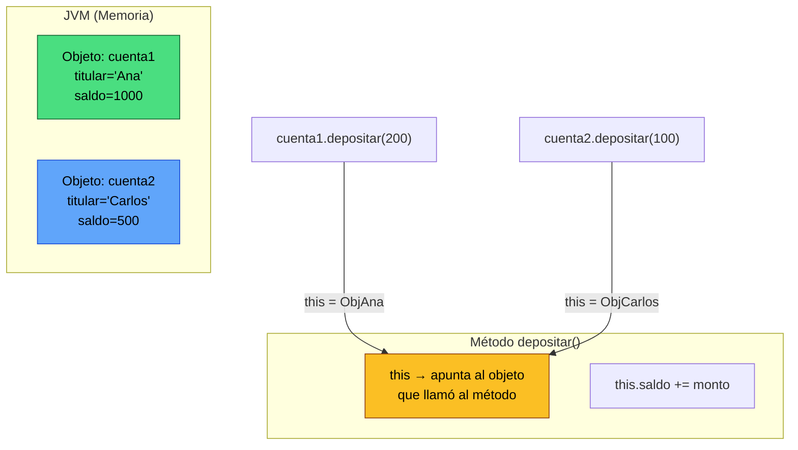
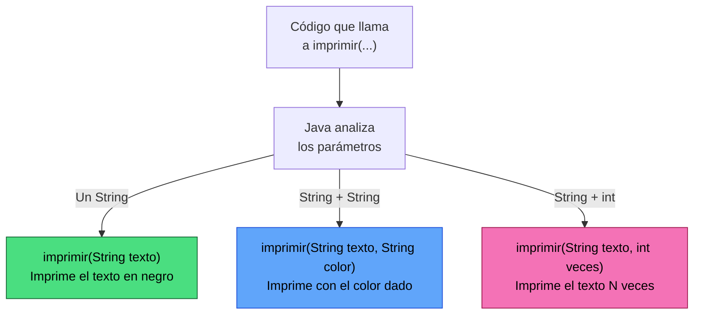
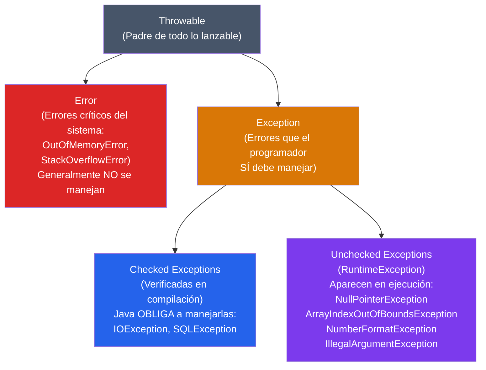

+++hero-section
---
title: "Lógica de Negocio, `this` y Excepciones"
subtitle: "Tus clases ya tienen datos. Ahora aprende a hacerlas inteligentes: define reglas, toma decisiones, maneja errores y construye software que funcione en el mundo real."
backgroundImage: "https://images.unsplash.com/photo-1555949963-aa79dcee981c?q=80&w=2070"
overlayOpacity: 0.7
buttons:
  - text: "Comenzar"
    url: "#1-construccion-de-la-logica-de-negocio"
    variant: "primary"
    icon: "CpuChipIcon"
  - text: "Documentación Oracle"
    url: "https://docs.oracle.com/javase/tutorial/essential/exceptions/"
    variant: "secondary"
---
+++

Hasta ahora hemos aprendido a crear clases con atributos, constructores y métodos de acceso (getters/setters). Nuestra clase sabe **guardar** información. Pero un programa profesional necesita que sus clases también sepan **pensar**: aplicar reglas, tomar decisiones y responder correctamente incluso ante situaciones inesperadas.

Esta semana damos ese salto crucial. Vamos a estudiar tres pilares del software profesional:

1.  **Lógica de negocio**: Las reglas que definen cómo funciona realmente una aplicación (no solo guardar datos, sino saber qué hacer con ellos).
2.  **El operador `this`**: La palabra clave que le da identidad propia a cada objeto.
3.  **Sobrecarga de métodos y Excepciones**: Flexibilidad para múltiples situaciones y robustez ante los errores.

---

## 1. Construcción de la Lógica de Negocio

### ¿Qué es la "Lógica de Negocio"?

Imagina que estás construyendo el software de un banco. El banco tiene **reglas**:
- No se puede retirar más dinero del que hay en la cuenta.
- Un depósito siempre debe ser mayor a cero.
- Si la cuenta tiene deuda, no puede cerrarla.

Esas reglas se llaman **lógica de negocio**. No son reglas del lenguaje Java, son las reglas del *negocio o sistema* que estamos programando.

> **Principio fundamental:** La lógica de negocio **vive DENTRO de las clases**, no en el `main`. Tu clase es la experta en sí misma. El `main` solo le pide cosas.

+++timeline
### Paso 1 | La clase "tonta" (Solo guarda datos)
La clase solo tiene atributos y getters/setters. No tiene reglas propias. Cualquiera puede poner `saldo = -9999` sin ningún freno.
`public class CuentaBancaria { private double saldo; }`

---

### Paso 2 | Añadir las reglas de negocio
Creamos **métodos de negocio** que encapsulan las reglas. El saldo ya no se modifica libremente, sino a través de métodos que validan cada operación.
`public void depositar(double monto) { ... }`

---

### Paso 3 | Manejar los errores
¿Qué pasa si alguien intenta retirar más de lo que hay? El método lo detecta y lanza una **excepción** (error) que le avisa al programa que algo salió mal.
`throw new IllegalArgumentException("Fondos insuficientes");`

---

### Paso 4 | La clase "inteligente" completa
La clase ahora es una experta en sí misma. Tiene datos, reglas y responde sensatamente ante situaciones incorrectas. Eso es software profesional.
`cuenta.retirar(500); // La clase sabe si puede o no puede.`
+++

### Construyendo una Clase de Lógica de Negocio Paso a Paso

Vamos a construir juntos una clase `CuentaBancaria` desde cero, explicando cada parte:

```tabs
---[tab title="1. La Clase Base" lang="java"]---
// Empezamos con lo básico: la estructura y los datos.
// Esta es la "materia prima" a la que le agregaremos inteligencia.

public class CuentaBancaria {

    // ATRIBUTOS: Los datos que el objeto "recuerda"
    private String titular;    // El dueño de la cuenta
    private double saldo;      // El dinero disponible
    private boolean activa;    // ¿Está la cuenta abierta?

    // CONSTRUCTOR: Cómo nace (se crea) una cuenta
    public CuentaBancaria(String titular, double saldoInicial) {
        this.titular = titular;
        this.saldo = saldoInicial;
        this.activa = true; // Una cuenta nueva siempre comienza activa
    }

    // GETTERS: Métodos para leer los datos
    public String getTitular() { return this.titular; }
    public double getSaldo()   { return this.saldo; }
    public boolean isActiva()  { return this.activa; }
}
---[tab title="2. Añadir Lógica: depositar()" lang="java"]---
// Ahora añadimos el primer método de negocio: depositar dinero.
// No es solo un setter, aplica REGLAS:
//   - El monto debe ser MAYOR que cero.
//   - La cuenta debe estar ACTIVA.

public void depositar(double monto) {

    // REGLA 1: Verificar que la cuenta esté activa
    if (!this.activa) {
        System.out.println("❌ Error: No se puede depositar en una cuenta inactiva.");
        return; // 'return' detiene la ejecución del método aquí.
    }

    // REGLA 2: Verificar que el monto sea válido
    if (monto <= 0) {
        System.out.println("❌ Error: El monto a depositar debe ser mayor a cero.");
        return;
    }

    // Si llegamos aquí, ¡todo está bien! Realizamos la operación.
    this.saldo = this.saldo + monto;
    System.out.println("✅ Depósito de $" + monto + " exitoso. Nuevo saldo: $" + this.saldo);
}
---[tab title="3. Añadir Lógica: retirar()" lang="java"]---
// El retiro tiene más restricciones que el depósito:
//   - La cuenta debe estar activa.
//   - El monto debe ser mayor a cero.
//   - NO SE PUEDE retirar más de lo que hay (saldo insuficiente).

public void retirar(double monto) {

    // REGLA 1: Cuenta activa
    if (!this.activa) {
        System.out.println("❌ No se puede retirar de una cuenta inactiva.");
        return;
    }

    // REGLA 2: Monto válido
    if (monto <= 0) {
        System.out.println("❌ El monto a retirar debe ser mayor a cero.");
        return;
    }

    // REGLA 3: ¿Hay suficiente saldo?
    //          Esta es la regla de negocio más importante aquí.
    if (monto > this.saldo) {
        System.out.println("❌ Fondos insuficientes. Saldo actual: $" + this.saldo);
        return;
    }

    // Todo en orden: ejecutamos el retiro
    this.saldo = this.saldo - monto;
    System.out.println("✅ Retiro de $" + monto + " exitoso. Saldo restante: $" + this.saldo);
}
---[tab title="4. Clase Completa + Main" lang="java"]---
// ====== CuentaBancaria.java ======
public class CuentaBancaria {
    private String titular;
    private double saldo;
    private boolean activa;

    public CuentaBancaria(String titular, double saldoInicial) {
        this.titular = titular;
        this.saldo   = saldoInicial;
        this.activa  = true;
    }

    public void depositar(double monto) {
        if (!this.activa || monto <= 0) {
            System.out.println("❌ Depósito inválido.");
            return;
        }
        this.saldo += monto;
        System.out.println("✅ Depósito OK. Saldo: $" + this.saldo);
    }

    public void retirar(double monto) {
        if (!this.activa || monto <= 0 || monto > this.saldo) {
            System.out.println("❌ Retiro inválido.");
            return;
        }
        this.saldo -= monto;
        System.out.println("✅ Retiro OK. Saldo: $" + this.saldo);
    }

    public void cerrarCuenta() {
        this.activa = false;
        System.out.println("Cuenta de " + this.titular + " cerrada.");
    }

    public double getSaldo()   { return this.saldo; }
    public String getTitular() { return this.titular; }
    public boolean isActiva()  { return this.activa; }
}

// ====== Main.java ======
public class Main {
    public static void main(String[] args) {
        // Creamos una cuenta con $1000 de saldo inicial
        CuentaBancaria miCuenta = new CuentaBancaria("Ana García", 1000.0);

        miCuenta.depositar(500.0);  // ✅ Saldo: $1500
        miCuenta.retirar(200.0);    // ✅ Saldo: $1300
        miCuenta.retirar(9999.0);   // ❌ Fondos insuficientes
        miCuenta.cerrarCuenta();    // Cuenta cerrada
        miCuenta.depositar(100.0);  // ❌ Cuenta inactiva
    }
}
```

```admonition
---
type: note
title: "¿Por qué no ponemos las reglas en el 'main'?"
---
Porque el `main` puede ser llamado desde muchos lugares. Si las reglas están en el `main`, deberías copiarlas en cada lugar donde crees una cuenta. Si alguna regla cambia (por ejemplo, el banco decide permitir sobregiros), tendrías que buscar y cambiar el código en 10 sitios diferentes.

**Con la lógica en la clase**, cambias solo en un lugar y todo el sistema queda actualizado. Esto se llama principio de **responsabilidad única** y es uno de los fundamentos del buen diseño de software.
```

---

## 2. El Operador `this`

### ¿Qué significa `this`?

`this` es una palabra clave de Java que literalmente significa **"yo mismo"** o **"este objeto"**. Cuando un objeto ejecuta un método, `this` es una referencia al propio objeto que está ejecutando ese código.

Piénsalo así: si Ana y Carlos son dos objetos `CuentaBancaria`, cuando Ana ejecuta `depositar()`, dentro del código de ese método, `this` es Ana. Cuando Carlos lo ejecuta, `this` es Carlos.



### Los 3 Usos Principales de `this`

```tabs
---[tab title="Uso 1: Desambiguar nombres" lang="java"]---
// EL PROBLEMA MÁS COMÚN:
// Cuando el parámetro del método tiene el MISMO NOMBRE que el atributo,
// Java se confunde. ¿A cuál "nombre" se refiere la asignación?

public class Persona {
    private String nombre; // <-- atributo de la clase
    private int edad;      // <-- atributo de la clase

    public Persona(String nombre, int edad) {
        //     ↑ parámetro  ↑ parámetro
        // Ambos parámetros tienen el mismo nombre que los atributos.
        // Java (y el programador) pueden confundirse fácilmente.

        // SIN this:  nombre = nombre;
        // Java asigna el parámetro a sí mismo. ¡El atributo queda vacío!
        // Esto es un bug muy difícil de detectar.

        // CON this: Le decimos explícitamente:
        //   "this.nombre" = el atributo de ESTE objeto
        //   "nombre" = el parámetro que me pasaron
        this.nombre = nombre; // ✅ El atributo recibe el valor del parámetro
        this.edad   = edad;   // ✅ Correcto y claro
    }
}
---[tab title="Uso 2: Llamar otro constructor" lang="java"]---
// Puedes invocar un constructor DESDE OTRO constructor de la misma clase.
// Esto evita repetir código de inicialización.
// IMPORTANTE: this(...) debe ser la PRIMERA línea del constructor.

public class Producto {
    private String nombre;
    private double precio;
    private String categoria;

    // Constructor completo (el "principal")
    public Producto(String nombre, double precio, String categoria) {
        this.nombre    = nombre;
        this.precio    = precio;
        this.categoria = categoria;
    }

    // Constructor simplificado: Si no doy categoría, uso "General" por defecto.
    // En vez de repetir las 3 líneas de arriba, simplemente llamo al constructor completo.
    public Producto(String nombre, double precio) {
        this(nombre, precio, "General"); // ← Llama al constructor de arriba
        // Lo que esté después de esta línea se ejecuta luego del otro constructor.
        System.out.println("Producto creado con categoría por defecto.");
    }

    // Constructor mínimo: Solo nombre, precio = 0.
    public Producto(String nombre) {
        this(nombre, 0.0); // ← Llama al constructor de arriba (que llama al principal)
    }
}
---[tab title="Uso 3: Pasar el objeto como argumento" lang="java"]---
// A veces un método necesita pasarse a SÍ MISMO como parámetro a otro método.
// Esto es muy común en patrones de diseño avanzados (Builder, Observer).

public class Formulario {
    private String titulo;

    public Formulario(String titulo) {
        this.titulo = titulo;
    }

    public void enviar() {
        // Pasamos 'this' (el formulario completo) al Validador.
        // El validador recibe el objeto y puede inspeccionar sus datos.
        Validador.validar(this);
    }
}

public class Validador {
    // Este método recibe cualquier Formulario y lo valida.
    public static void validar(Formulario f) {
        System.out.println("Validando formulario: " + f.titulo);
        // ... lógica de validación ...
    }
}
---[tab title="Comparación: Con y Sin this" lang="java"]---
// ========== SIN this (código confuso y con bugs) ==========
public class Circulo {
    private double radio;

    public Circulo(double radio) {
        radio = radio; // ❌ ¡BUG! El parámetro se asigna a sí mismo.
        // El atributo this.radio nunca fue inicializado. Queda en 0.0
    }

    public double calcularArea() {
        // radio aquí es el ATRIBUTO (que vale 0, no el parámetro)
        return Math.PI * radio * radio; // Siempre devuelve 0. ¡Bug silencioso!
    }
}

// ========== CON this (código correcto y explícito) ==========
public class Circulo {
    private double radio;

    public Circulo(double radio) {
        this.radio = radio; // ✅ Claro: el atributo recibe el valor del parámetro
    }

    public double calcularArea() {
        return Math.PI * this.radio * this.radio; // ✅ Usa el atributo real
    }
}
```

```admonition
---
type: tip
title: "¿Cuándo DEBO usar this?"
---
**Obligatorio:** Cuando el nombre del parámetro es igual al nombre del atributo (como en constructores y setters).

**Opcional pero recomendado:** Siempre que quieras dejar super-claro en el código que estás accediendo a un atributo del objeto, no a una variable local. Muchos programadores profesionales escriben `this.` en todos sus atributos por claridad.
```

---

## 3. Sobrecarga de Métodos

### ¿Qué es la Sobrecarga (Overloading)?

La **sobrecarga de métodos** es la capacidad de tener **varios métodos con el mismo nombre** en una misma clase, pero con **diferentes parámetros**. Java los diferencia por su "firma" (el nombre + la lista de parámetros).

**Analogía del mundo real:** Cuando le dices a un chef "prepara algo", él necesita saber ¿qué? Si le dices "prepara pasta", ya sabe algo. Si le dices "prepara pasta con salsa y queso", sabe aún más. El chef tiene múltiples versiones de "preparar" según lo que le pidas.



### Reglas de la Sobrecarga

Para que dos métodos sean considerados "sobrecargas válidas", deben diferir en **al menos uno** de estos aspectos:
- El **número** de parámetros.
- El **tipo** de los parámetros.
- El **orden** de los parámetros.

> **¡Atención!** Cambiar solo el **nombre del parámetro** o el **tipo de retorno** NO es sobrecarga válida. Java daría un error de compilación.

```tabs
---[tab title="Ejemplo 1: Calculadora" lang="java"]---
// La calculadora puede sumar diferentes tipos de números.
// Mismo nombre 'sumar', distintos parámetros → Sobrecarga.

public class Calculadora {

    // Versión 1: Suma dos números enteros
    public int sumar(int a, int b) {
        System.out.println("Sumando dos enteros...");
        return a + b;
    }

    // Versión 2: Suma tres números enteros
    public int sumar(int a, int b, int c) {
        System.out.println("Sumando tres enteros...");
        return a + b + c;
    }

    // Versión 3: Suma dos números decimales
    public double sumar(double a, double b) {
        System.out.println("Sumando dos doubles...");
        return a + b;
    }
}

// ====== Main.java ======
public class Main {
    public static void main(String[] args) {
        Calculadora calc = new Calculadora();

        int resultado1 = calc.sumar(5, 3);          // Llama a Versión 1 → 8
        int resultado2 = calc.sumar(5, 3, 2);       // Llama a Versión 2 → 10
        double resultado3 = calc.sumar(5.5, 2.2);   // Llama a Versión 3 → 7.7

        System.out.println(resultado1); // 8
        System.out.println(resultado2); // 10
        System.out.println(resultado3); // 7.7
    }
}
---[tab title="Ejemplo 2: Notificaciones" lang="java"]---
// Un sistema de notificaciones con diferentes niveles de detalle.

public class Notificador {

    // Notificación básica: solo mensaje
    public void enviar(String mensaje) {
        System.out.println("📬 [NOTIFICACIÓN]: " + mensaje);
    }

    // Notificación con destinatario
    public void enviar(String mensaje, String destinatario) {
        System.out.println("📬 Para: " + destinatario);
        System.out.println("   Mensaje: " + mensaje);
    }

    // Notificación urgente con prioridad
    public void enviar(String mensaje, String destinatario, int prioridad) {
        String nivel = (prioridad >= 5) ? "🔴 URGENTE" : "🟡 NORMAL";
        System.out.println(nivel + " Para: " + destinatario);
        System.out.println("   Mensaje: " + mensaje);
        System.out.println("   Prioridad: " + prioridad + "/10");
    }
}

// ====== Main.java ======
public class Main {
    public static void main(String[] args) {
        Notificador n = new Notificador();

        n.enviar("El sistema se actualizará.");
        n.enviar("Tu contraseña fue cambiada.", "carlos@mail.com");
        n.enviar("¡Intento de hackeo detectado!", "admin@mail.com", 9);
    }
}
---[tab title="¿Qué NO es sobrecarga?" lang="java"]---
// ❌ INCORRECTO: No puedes cambiar solo el NOMBRE del parámetro.
// Estos dos métodos PARECEN diferentes, pero para Java son idénticos.

public class Error1 {
    public void procesar(int numero) { }   // ← Método 1
    public void procesar(int valor)  { }   // ← ❌ Error: mismo tipo de param
}

// ❌ INCORRECTO: No puedes cambiar solo el TIPO DE RETORNO.
// Java no puede distinguirlos al llamar al método sin ver el resultado.

public class Error2 {
    public int    calcular(int x) { return x; }     // ← Método 1
    public double calcular(int x) { return x; }     // ← ❌ Error: mismo param
}

// ✅ CORRECTO: Diferente número de parámetros
public class Correcto {
    public void procesar(int a)        { } // 1 param de tipo int
    public void procesar(int a, int b) { } // 2 params de tipo int → ✅ Válido
}

// ✅ CORRECTO: Mismo número pero diferente tipo
public class Correcto2 {
    public void imprimir(int numero)    { } // param: int
    public void imprimir(String texto)  { } // param: String → ✅ Válido
}
```

---

## 4. Manejo de Excepciones

### ¿Qué es una Excepción?

Una **excepción** es un error que ocurre mientras el programa se está ejecutando. No es un error de escritura (eso lo detectaría el compilador), sino un error de **lógica o de situación**: intentar dividir entre cero, abrir un archivo que no existe, o convertir un texto no numérico a número.

Cuando Java encuentra una situación así, "lanza" (throw) una excepción. Si nadie la "atrapa" (catch), el programa se detiene abruptamente y muestra un error horrible en pantalla.

```admonition
---
type: caution
title: "¿Qué pasa si NO manejas las excepciones?"
---
El programa se cierra sin avisar. El usuario ve un mensaje técnico incomprensible. Los datos pueden quedar corruptos o sin guardar. En un contexto empresarial, esto genera pérdidas y desconfianza.

```

### La Jerarquía de Excepciones en Java



### La Estructura `try-catch-finally`

Es el mecanismo principal para manejar excepciones. Funciona como una red de seguridad.

```java
try {
    // 1. INTENTA ejecutar este código "peligroso"
    //    Si algo sale mal aquí, Java lanza una excepción
    //    y salta directamente al bloque catch.

} catch (TipoDeExcepcion e) {
    // 2. ATRAPA la excepción si ocurrió.
    //    'e' es el objeto de error. Contiene información sobre qué pasó.
    //    e.getMessage() → Mensaje del error
    //    e.printStackTrace() → Traza completa (para debug)

} finally {
    // 3. SIEMPRE se ejecuta, haya error o no.
    //    Usado para cerrar recursos: archivos, conexiones de BD, etc.
    //    Este bloque es OPCIONAL.
}
```

### Ejemplos Prácticos, de Menor a Mayor Complejidad

```tabs
---[tab title="1. División por Cero" lang="java"]---
// Uno de los errores más clásicos: dividir entre cero.

public class EjemploDivision {
    public static void main(String[] args) {

        int dividendo = 100;
        int divisor   = 0; // Imagina que este valor viene de un usuario

        try {
            // Java lanza ArithmeticException si el divisor es 0
            int resultado = dividendo / divisor;
            System.out.println("Resultado: " + resultado);

        } catch (ArithmeticException e) {
            // Llegamos aquí porque el divisor fue cero.
            System.out.println("❌ Error matemático: " + e.getMessage());
            // e.getMessage() devolverá: "/ by zero"

        } finally {
            // Esto se ejecuta siempre, sea o no sea error
            System.out.println("ℹ️ Operación de división finalizada.");
        }

        // El programa continúa normalmente después del try-catch
        System.out.println("El programa sigue funcionando correctamente. ✅");
    }
}
---[tab title="2. Parseo Inválido" lang="java"]---
// Error muy común: recibir texto de un usuario y tratar de convertirlo a número.

public class EjemploParseo {
    public static void main(String[] args) {

        // Simula la entrada de un usuario (que podría escribir cualquier cosa)
        String inputUsuario = "veintidós"; // No es un número válido

        try {
            // Integer.parseInt lanza NumberFormatException si el texto no es numérico
            int edad = Integer.parseInt(inputUsuario);
            System.out.println("Tu edad es: " + edad);

        } catch (NumberFormatException e) {
            System.out.println("❌ Valor inválido. '" + inputUsuario + "' no es un número.");
            System.out.println("   Por favor, ingresa solo dígitos como: 25");

        }
        // Sin 'finally': es opcional, solo lo usamos si necesitamos limpiar algo.
    }
}
---[tab title="3. Múltiples catch" lang="java"]---
// Un bloque try puede lanzar diferentes tipos de excepciones.
// Podemos atrapar cada tipo por separado y dar una respuesta específica.

public class EjemploMultipleCatch {
    public static void main(String[] args) {

        String[] nombres = {"Ana", "Luis", "Sofía"}; // Array de 3 elementos (índices 0, 1, 2)
        String edadTexto = "treinta";                 // Texto inválido para parsear

        try {
            // Posible excepción 1: ArrayIndexOutOfBoundsException (índice 5 no existe)
            String nombre = nombres[5];

            // Posible excepción 2: NumberFormatException
            int edad = Integer.parseInt(edadTexto);

            System.out.println(nombre + " tiene " + edad + " años.");

        } catch (ArrayIndexOutOfBoundsException e) {
            // Solo se ejecuta si hubo un problema de índice
            System.out.println("❌ Error de índice: Accediste a una posición que no existe.");
            System.out.println("   El array tiene " + nombres.length + " elementos (índices 0 a " + (nombres.length - 1) + ").");

        } catch (NumberFormatException e) {
            // Solo se ejecuta si hubo un problema de conversión de texto
            System.out.println("❌ Error de número: '" + edadTexto + "' no es válido.");

        } catch (Exception e) {
            // Captura genérica: para CUALQUIER otra excepción no prevista
            // Siempre va AL FINAL, de lo contrario bloquearía los catch anteriores.
            System.out.println("❌ Error inesperado: " + e.getMessage());

        } finally {
            System.out.println("ℹ️ Proceso completado (con o sin error).");
        }
    }
}
---[tab title="4. Lanzar con throw" lang="java"]---
// Tú mismo puedes CREAR y LANZAR excepciones con la palabra 'throw'.
// Esto es perfecto para hacer cumplir tus reglas de negocio.

public class CuentaBancaria {
    private double saldo;

    public CuentaBancaria(double saldoInicial) {
        // REGLA DE NEGOCIO: Una cuenta no puede abrirse con saldo negativo.
        if (saldoInicial < 0) {
            // Lanzamos una excepción con un mensaje de error claro.
            throw new IllegalArgumentException(
                "El saldo inicial no puede ser negativo: " + saldoInicial
            );
        }
        this.saldo = saldoInicial;
    }

    public void retirar(double monto) {
        if (monto <= 0) {
            throw new IllegalArgumentException("El monto a retirar debe ser mayor a cero.");
        }
        if (monto > this.saldo) {
            throw new IllegalStateException(
                "Fondos insuficientes. Saldo: " + this.saldo + ", Retiro solicitado: " + monto
            );
        }
        this.saldo -= monto;
        System.out.println("✅ Retiro de $" + monto + " exitoso.");
    }

    public double getSaldo() { return this.saldo; }
}

// ====== Main.java ======
public class Main {
    public static void main(String[] args) {

        // Intento 1: Crear cuenta con saldo negativo (lanzará error)
        try {
            CuentaBancaria cuentaMala = new CuentaBancaria(-500);
        } catch (IllegalArgumentException e) {
            System.out.println("❌ No se pudo crear la cuenta: " + e.getMessage());
        }

        // Intento 2: Cuenta válida, retiro con fondos insuficientes
        try {
            CuentaBancaria cuenta = new CuentaBancaria(200.0);
            cuenta.retirar(500.0); // Más de lo que hay → IllegalStateException
        } catch (IllegalStateException e) {
            System.out.println("❌ No se pudo retirar: " + e.getMessage());
        }

        // Intento 3: Todo correcto
        try {
            CuentaBancaria cuenta = new CuentaBancaria(1000.0);
            cuenta.retirar(300.0); // ✅
            System.out.println("Saldo final: $" + cuenta.getSaldo()); // $700
        } catch (Exception e) {
            System.out.println("❌ Error: " + e.getMessage());
        }
    }
}
```

### Excepciones Más Comunes en Java

```cards
---
columns: 3
items:
  - title: "NullPointerException"
    icon: "ExclamationTriangleIcon"
    content: |
      Intentas usar un objeto que vale `null`.
      `String s = null;`
      `s.length(); // ❌ Boom`
  - title: "ArrayIndexOutOfBoundsException"
    icon: "ExclamationTriangleIcon"
    content: |
      Accedes a un índice inexistente en un array.
      `int[] a = new int[3];`
      `a[5] = 10; // ❌ Solo hay 0,1,2`
  - title: "NumberFormatException"
    icon: "ExclamationTriangleIcon"
    content: |
      Parseas un texto inválido a número.
      `Integer.parseInt("hola"); // ❌`
  - title: "ClassCastException"
    icon: "ExclamationTriangleIcon"
    content: |
      Haces un cast imposible entre tipos incompatibles.
      `Object obj = "texto";`
      `(Integer) obj; // ❌`
  - title: "IllegalArgumentException"
    icon: "ExclamationTriangleIcon"
    content: |
      Un argumento no válido fue pasado a un método.
      Comúnmente lanzado manualmente con `throw`.
  - title: "IllegalStateException"
    icon: "ExclamationTriangleIcon"
    content: |
      El objeto está en un estado incorrecto para la operación solicitada. (Cuenta inactiva, lista bloqueada, etc.)
---
```

### Buenas Prácticas con Excepciones

```accordion
---
allowMultiple: true
---
### ✅ 1. Nunca atrapes `Exception` a ciegas para todo
Captura la excepción específica que esperas. Si atrapas `Exception` para todo sin distinguir el tipo, ocultas bugs reales y hace tu código difícil de entender. Usa el `catch (Exception e)` genérico solo como último recurso.

### ✅ 2. Siempre muestra un mensaje útil al usuario
Un trace técnico como `java.lang.ArithmeticException: / by zero` no le sirve a un usuario. Traduce el error a un mensaje claro y de acción: "El divisor no puede ser cero. Por favor ingrese un número diferente."

### ✅ 3. Usa `finally` para limpiar recursos
Si abres una conexión de base de datos o un archivo dentro de un `try`, ciérralo en el `finally`. Si no lo haces y hay una excepción, el recurso queda abierto y consume memoria — lo que se conoce como "fuga de recursos" (resource leak).

### ✅ 4. Lanza excepciones con mensajes descriptivos
Cuando uses `throw new IllegalArgumentException(...)`, incluye en el mensaje el valor que causó el problema y qué se esperaba. Ej: "La edad no puede ser negativa. Valor recibido: -5. Se esperaba un valor entre 0 y 120."

### ❌ 5. No silencies las excepciones (catch vacío)
Un bloque `catch` vacío que no hace nada es uno de los errores más peligrosos:
`catch (Exception e) { }` — El error "desaparece", el estado de tu programa puede quedar corrupto y nunca sabrás qué falló.
```

---

## Integrando Todo: Ejemplo Final Completo

En este ejemplo final vemos los tres temas trabajando juntos: lógica de negocio en una clase `Tienda`, el operador `this`, la sobrecarga de métodos en `registrarVenta()`, y el manejo de excepciones con `try-catch-throw`.

```tabs
---[tab title="Producto.java" lang="java"]---
public class Producto {
    // Atributos
    private String nombre;
    private double precio;
    private int stock;

    // Constructor usando 'this' para disambiguar nombres
    public Producto(String nombre, double precio, int stock) {
        if (precio < 0) {
            throw new IllegalArgumentException("El precio no puede ser negativo: " + precio);
        }
        if (stock < 0) {
            throw new IllegalArgumentException("El stock no puede ser negativo: " + stock);
        }
        this.nombre = nombre;
        this.precio = precio;
        this.stock  = stock;
    }

    // Constructor sobrecargado: stock por defecto en 0
    public Producto(String nombre, double precio) {
        this(nombre, precio, 0); // ← Llama al constructor principal
    }

    // Getters
    public String getNombre() { return this.nombre; }
    public double getPrecio() { return this.precio; }
    public int    getStock()  { return this.stock; }

    // Método de negocio: reducir stock
    public void reducirStock(int cantidad) {
        if (cantidad <= 0) {
            throw new IllegalArgumentException("La cantidad debe ser positiva.");
        }
        if (cantidad > this.stock) {
            throw new IllegalStateException(
                "Stock insuficiente para '" + this.nombre + "'. Stock actual: " + this.stock
            );
        }
        this.stock -= cantidad;
    }
}
---[tab title="Tienda.java" lang="java"]---
public class Tienda {
    private String nombre;
    private double totalVentas;

    public Tienda(String nombre) {
        this.nombre      = nombre;
        this.totalVentas = 0.0;
    }

    // Método de negocio sobrecargado:
    // Versión 1: Vender 1 unidad del producto
    public double registrarVenta(Producto producto) {
        return this.registrarVenta(producto, 1); // Llama a la versión 2
    }

    // Versión 2: Vender N unidades del producto
    public double registrarVenta(Producto producto, int cantidad) {
        // Intentamos reducir el stock. Si hay error, la excepción sube al llamante.
        producto.reducirStock(cantidad);

        double subtotal = producto.getPrecio() * cantidad;
        this.totalVentas += subtotal;

        System.out.println("✅ Venta registrada: " + cantidad + " x " +
                           producto.getNombre() + " = $" + subtotal);
        return subtotal;
    }

    // Getters
    public String getNombre()      { return this.nombre; }
    public double getTotalVentas() { return this.totalVentas; }
}
---[tab title="Main.java" lang="java"]---
public class Main {
    public static void main(String[] args) {

        // Creamos la tienda y los productos
        Tienda tienda = new Tienda("TechStore");
        Producto laptop  = new Producto("Laptop Pro", 2500000.0, 5);
        Producto mouse   = new Producto("Mouse Inalámbrico", 85000.0, 20);
        Producto teclado = new Producto("Teclado Mecánico", 150000.0); // Sin stock

        System.out.println("===== " + tienda.getNombre() + " =====\n");

        // Caso 1: Venta exitosa de 1 unidad (sobrecarga versión 1)
        try {
            tienda.registrarVenta(laptop);
        } catch (IllegalStateException e) {
            System.out.println("❌ No se pudo completar: " + e.getMessage());
        }

        // Caso 2: Venta exitosa de varias unidades (sobrecarga versión 2)
        try {
            tienda.registrarVenta(mouse, 3);
        } catch (IllegalStateException e) {
            System.out.println("❌ No se pudo completar: " + e.getMessage());
        }

        // Caso 3: Intento de venta sin stock suficiente
        try {
            tienda.registrarVenta(laptop, 10); // Solo hay 4 en stock (vendimos 1 antes)
        } catch (IllegalStateException e) {
            System.out.println("❌ No se pudo completar: " + e.getMessage());
        }

        // Caso 4: Producto sin stock
        try {
            tienda.registrarVenta(teclado);
        } catch (IllegalStateException e) {
            System.out.println("❌ No se pudo completar: " + e.getMessage());
        }

        // Resumen final
        System.out.println("\n=============================");
        System.out.println("Total de ventas del día: $" + tienda.getTotalVentas());
    }
}
```

---

+++quiz
---
questions:
  - text: "¿Para qué sirve principalmente el operador `this` en un constructor?"
    choices:
      - Para llamar a métodos de otras clases
      - Para diferenciar entre el atributo del objeto y el parámetro cuando tienen el mismo nombre
      - Para crear un nuevo objeto del mismo tipo
      - Para heredar de otra clase
    answer: "Para diferenciar entre el atributo del objeto y el parámetro cuando tienen el mismo nombre"
  - text: "¿Qué condición DEBE cumplirse para que dos métodos sean una sobrecarga válida?"
    choices:
      - Deben tener el mismo tipo de retorno
      - Deben tener diferente nombre
      - Deben diferir en el número o tipo de parámetros
      - Uno debe ser público y otro privado
    answer: "Deben diferir en el número o tipo de parámetros"
  - text: "¿Qué bloque del try-catch-finally se ejecuta SIEMPRE, aunque no haya excepción?"
    choices:
      - El bloque try
      - El bloque catch
      - El bloque finally
      - Ninguno, depende del resultado
    answer: "El bloque finally"
  - text: "Si quieres lanzar manualmente una excepción porque un argumento no es válido, ¿qué clase usarías?"
    choices:
      - NullPointerException
      - ArrayIndexOutOfBoundsException
      - IllegalArgumentException
      - RuntimeException
    answer: "IllegalArgumentException"
  - text: "¿Dónde debe estar la lógica de negocio de una aplicación orientada a objetos?"
    choices:
      - Siempre en el método main
      - En los archivos de configuración
      - Dentro de los métodos de las clases que representan los conceptos del negocio
      - En la base de datos únicamente
    answer: "Dentro de los métodos de las clases que representan los conceptos del negocio"
---
+++

```admonition
---
type: important
title: "🏆 Actividad en Clase: 4 Grupos de Trabajo"
---
**Instrucciones generales:**
1. Lean detenidamente el tema asignado a su grupo dentro de esta guía.
2. Preparen una **explicación en sus propias palabras** del tema, como si se lo fueran a enseñar a alguien que no lo conoce.
3. Creen **al menos 1 ejemplo de código en Java** diferente a los del documento que demuestre el tema.
4. Un representante del grupo presenta la explicación y el ejemplo al resto del salón.
```


### 📦 Grupo 1 — Lógica de Negocio

**Tema:** Sección 1 de la guía — *Construcción de la lógica de negocio*.

**¿Qué deben explicar?**
- ¿Qué significa que una clase tenga "lógica de negocio"?
- ¿Por qué las reglas NO deben estar en el `main`?
- ¿Cómo se valida que una operación sea válida antes de ejecutarla?

**Ejemplo propio:** Creen una clase `Biblioteca` con un método `prestarLibro()` que verifique que el libro esté disponible y que el usuario no tenga más de 3 libros prestados. Incluyan un `Main` que pruebe casos válidos e inválidos.

---

### 🔑 Grupo 2 — El Operador `this`

**Tema:** Sección 2 de la guía — *El operador `this`*.

**¿Qué deben explicar?**
- ¿Qué significa `this` y para qué sirve?
- ¿Qué pasa si NO se usa `this` cuando hay conflicto de nombres? (mostrar el bug)
- ¿Cómo se usa `this(...)` para llamar otro constructor?

**Ejemplo propio:** Creen una clase `Empleado` con tres constructores sobrecargados que se encadenen usando `this(...)`, y usen `this.atributo` en todos los setters. Muestren en el `Main` las tres formas de crear un `Empleado`.

---

### 🔀 Grupo 3 — Sobrecarga de Métodos

**Tema:** Sección 3 de la guía — *Sobrecarga de métodos*.

**¿Qué deben explicar?**
- ¿Qué es la sobrecarga y qué la diferencia de tener métodos con distintos nombres?
- ¿Qué condiciones debe cumplir una sobrecarga para ser válida?
- ¿Cuándo es útil en la práctica?

**Ejemplo propio:** Creen una clase `Impresora` con 3 versiones del método `imprimir()`: solo texto, texto con número de copias, y texto con copias y color. Demuestren en el `Main` cómo Java escoge automáticamente la versión correcta según los argumentos.

---

### 🛡️ Grupo 4 — Manejo de Excepciones

**Tema:** Sección 4 de la guía — *Manejo de excepciones*.

**¿Qué deben explicar?**
- ¿Qué es una excepción y por qué el programa se detiene si no se maneja?
- ¿Cómo funciona el bloque `try-catch-finally`?
- ¿Cuándo se usa `throw` para lanzar una excepción manualmente?

**Ejemplo propio:** Creen una clase `Cajero` con un método `retirar(double monto)` que use `throw` si el monto es inválido o supera el saldo. En el `Main`, envuelvan las llamadas en `try-catch` y demuestren los tres bloques (`try`, `catch`, `finally`).
