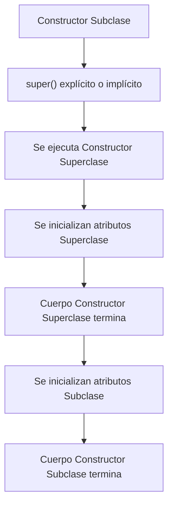

+++hero-section
---
title: "Mecánica Avanzada de Herencia"
subtitle: "Domina los detalles que separan a los novatos de los expertos: desde la raíz de Java hasta el control total del árbol de herencia."
backgroundImage: "https://images.unsplash.com/photo-1518433278993-0a7fb7a4969b?q=80&w=2070"
overlayOpacity: 0.72
buttons:
  - text: "Comenzar"
    url: "#1-la-clase-raiz-object"
    variant: "primary"
    icon: "AcademicCapIcon"
  - text: "Documentación Object"
    url: "https://docs.oracle.com/javase/8/docs/api/java/lang/Object.html"
    variant: "secondary"
---
+++

En la semana anterior aprendiste las bases: `extends`, `super` y cómo reutilizar código. Ahora es momento de mirar "bajo el capó" y entender cómo Java gestiona internamente estas jerarquías para evitar errores comunes y escribir código más robusto. 🛠️

---

## 1. La Clase Raíz: `java.lang.Object`

En Java, no existe ninguna clase que esté "sola". Si defines una clase sin usar `extends`, Java automáticamente hace que herede de la clase **Object**.

**Object** es la madre de todas las clases. Gracias a ella, todos los objetos en Java tienen métodos básicos garantizados.

### Métodos Clave para Sobreescribir

+++tabs
---[tab title="toString()" lang="java"]---
// Por defecto, toString() devuelve: NombreClase@hascode
// DEBES sobreescribirlo para dar información útil.

@Override
public String toString() {
    return "Empleado [nombre=" + nombre + ", id=" + id + "]";
}

// Ahora System.out.println(empleado) mostrará algo legible.
---[tab title="equals()" lang="java"]---
// Por defecto, '==' compara si son el MISMO objeto en memoria.
// Con equals() comparas si los DATOS internos son iguales.

@Override
public boolean equals(Object obj) {
    if (this == obj) return true;
    if (obj == null || getClass() != obj.getClass()) return false;
    Empleado other = (Empleado) obj;
    return id.equals(other.id); // Dos empleados son iguales si tienen el mismo ID
}
---
+++

---

## 2. Evitando la Herencia con `final`

A veces quieres que tu diseño sea "cerrado". La palabra clave `final` tiene dos usos poderosos en herencia:

### A. Clases Finales (`final class`)
Una clase marcada como `final` **no puede ser heredada**. Nadie puede crear una subclase de ella. 
*Ejemplo real: La clase `String` en Java es `final` por seguridad.*

```java
public final class ValidadorSeguridad {
    // Nadie podrá extender esta clase para cambiar su comportamiento
}
```

### B. Métodos Finales (`final method`)
Un método marcado como `final` **no puede ser sobreescrito** por las clases hijas. Heredan el método, pero no pueden cambiar cómo funciona.

```java
public class Banco {
    public final void depositar(double monto) {
        // Regla crítica que nadie debe cambiar
    }
}
```

---

## 3. Ocultamiento de Atributos (Field Shadowing)

**¡Mucho cuidado aquí!** A diferencia de los métodos (que se sobreescriben), los atributos (campos) se **ocultan**.

Si una clase hija declara un atributo con el mismo nombre que uno del padre, el del padre sigue existiendo pero queda "en la sombra".

```java
public class Padre {
    public String nombre = "Papá";
}

public class Hijo extends Padre {
    public String nombre = "Hijo"; // OCULTA al del padre
    
    public void mostrar() {
        System.out.println(nombre);       // Imprime "Hijo"
        System.out.println(super.nombre); // Imprime "Papá"
    }
}
```

+++admonition
---
type: warning
title: "Mala Práctica"
---
Nunca declares atributos con el mismo nombre en jerarquías de herencia. Crea confusión y errores difíciles de encontrar. Usa nombres únicos o confía en el acceso vía métodos (getters/setters).
+++

---

## 4. El Orden de Construcción

¿Alguna vez te has preguntado quién nace primero? En Java, para crear un hijo, **siempre** debe existir el padre primero.



### Ejemplo de Rastreo:

```java
public class A {
    public A() { System.out.println("Nace A (Padre)"); }
}

public class B extends A {
    public B() { System.out.println("Nace B (Hijo)"); }
}

// Al hacer: new B();
// Salida:
// Nace A (Padre)
// Nace B (Hijo)
```

---

## 5. El Modificador `protected` y el Acceso de Paquete

Ya vimos que `protected` permite el acceso a las clases hijas. Pero hay un detalle fino que debes conocer:

*   **protected:** Visible para las clases hijas (en cualquier paquete) **Y** para cualquier clase en el mismo paquete.
*   **sin modificador (default):** Visible **SOLO** para clases en el mismo paquete.

+++comparison-table
---
headers:
  - "Escenario"
  - "default (Acceso Paquete)"
  - "protected"
rows:
  - ["Mismo Paquete", "✅ Visible", "✅ Visible"]
  - ["Paquete Diferente (Hijo)", "❌ No visible", "✅ Visible"]
  - ["Paquete Diferente (No Hijo)", "❌ No visible", "❌ No visible"]
---
+++

---

## 🏫 Actividad de Clase — Registro Vehicular

En esta actividad, aplicarás el control de herencia y la personalización de la clase `Object`.

### El Reto
Crea un sistema donde:
1.  Exista una clase `Vehiculo` con atributos `patente` y `marca`.
2.  Sobreescribe `toString()` para mostrar los datos de forma elegante.
3.  Sobreescribe `equals()` para que dos vehículos sean iguales si tienen la misma patente.
4.  Crea una clase `Camion` que sea `final` (jerarquía cerrada) y que use `super.toString()` para complementar su información.

+++tabs
---[tab title="Vehiculo.java" lang="java"]---
public class Vehiculo {
    private String patente;
    private String marca;

    public Vehiculo(String patente, String marca) {
        this.patente = patente;
        this.marca = marca;
    }

    @Override
    public String toString() {
        return "Vehículo [" + marca + "] - Patente: " + patente;
    }

    @Override
    public boolean equals(Object o) {
        if (this == o) return true;
        if (o == null || getClass() != o.getClass()) return false;
        Vehiculo vehiculo = (Vehiculo) o;
        return patente.equals(vehiculo.patente);
    }
}
---[tab title="Camion.java" lang="java"]---
public final class Camion extends Vehiculo {
    private double capacidadCarga;

    public Camion(String patente, String marca, double capacidad) {
        super(patente, marca);
        this.capacidadCarga = capacidad;
    }

    @Override
    public String toString() {
        // Usamos el toString del padre y le agregamos lo nuestro
        return super.toString() + " | Carga: " + capacidadCarga + "t";
    }
}
---
+++
