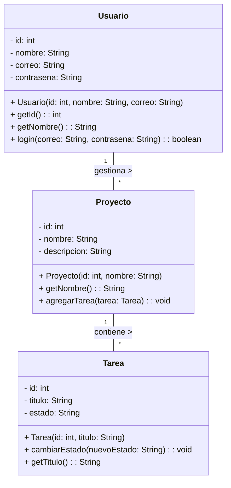

# Avance 1: Diagrama de Clases (POO) - BackEnd 1

**Fecha de Entrega:** Semana 6
**Rol:** Equipo de Desarrollo (Backend)

## 📌 Objetivo
Crear el **Diagrama de Clases (UML)** inicial del proyecto basándose en los requerimientos definidos por el equipo de Metodologías Ágiles (Acta de Constitución). Este diagrama será la base de tu código en Java.

## 📝 Qué debes entregar
1. **Analiza el proyecto:** Lee el Acta de Constitución y descubre cuáles son los objetos principales del sistema (ej. Usuario, Producto, Tarea).
2. **Crea el Diagrama de Clases:** Usando herramientas como Draw.io o Lucidchart, dibuja las clases necesarias.
3. **Detalla cada clase:**
   - **Atributos:** Sus características privadas (ej. `- id: int`, `- nombre: String`).
   - **Métodos:** Sus comportamientos públicos, incluyendo constructores, *getters*, *setters* y operaciones clave (ej. `+ crearUsuario(): void`).
   - **Relaciones:** Cómo se conectan las clases entre sí (si aplica).

## 💡 Ejemplo: App de Gestión de Tareas

Si el equipo de Metodologías define que harán un "Task Manager", tu diagrama de clases podría verse así con tres entidades principales:

*Nota: Usa el modificador `-` para atributos privados y `+` para métodos públicos (Encapsulamiento).*

## ✅ Criterios de Evaluación
Tu profesor (Tech Lead) revisará que:
- El diagrama tenga sentido según el proyecto elegido.
- Existan al menos 2 o 3 clases principales bien definidas.
- Se aplique correctamente la POO (Abstracción y Encapsulamiento con *getters/setters*).
- El formato sea claro y se pueda entender sin código.
